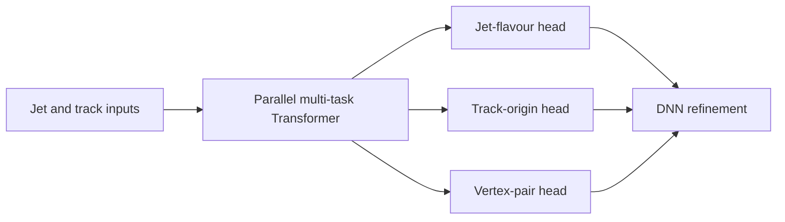
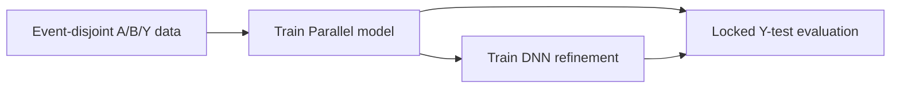

# SerialFlavour

SerialFlavour studies multi-task jet-flavour tagging with a GN2-inspired Transformer on ATLAS Open Data. The central question is whether track-origin and track-pair vertexing supervision can complement the main jet-flavour classification task, and whether their learned representations retain useful information for a lightweight downstream DNN. The repository therefore contains both the deployable Parallel model and a controlled frozen-feature comparison workflow.

## Project Architecture

```text
SerialFlavour/
├── src/
│   ├── config.py                Shared Parallel defaults and seed utilities
│   ├── data.py                  Shared HDF5 and atomic-cache helpers
│   ├── losses.py                Origin weighting and pair BCE
│   ├── parallel_model.py         Parallel Transformer implementation
│   ├── training.py               Reusable Parallel training and validation loop
│   └── parallel_refine/         A/B/Y split, cache, refiner, evaluation, and plots
├── configs/parallel_refine/     Component and experiment configurations
└── scripts/                     Python preparation, training, and evaluation entry points
```

## Model architecture

The Parallel model concatenates jet-level features to each track, encodes the track sequence with a shared Transformer, and applies three heads for jet flavour, track origin, and track-pair vertex compatibility. Attention pooling produces a global jet representation for the jet classifier and supplies context to the origin and vertex heads. The three heads share the same configurable MLP pattern while operating on jet-, track-, and track-pair-level inputs respectively.

The downstream comparison does not retrain the Transformer. It freezes the selected Parallel checkpoint, pools its prediction and representation features, and trains a tabular DNN on selected feature recipes, refining the performance of parallel model.



## Workflow

The workflow uses event-disjoint A/B/Y splits. A-train and A-val train and select the upstream Parallel checkpoint. B-train and B-val provide the data for frozen-feature DNN readouts. Y-test remains locked for final evaluation of both the upstream model and each DNN recipe.

Input normalisation is derived from A-train only. The data preparation stage also applies the configured track selection and kinematic resampling, while the pair target follows the Open Data truth-vertex convention. This keeps upstream training, downstream fitting, and final evaluation separated.



## Configurations and outputs

Experiment configurations in `configs/parallel_refine/` combine independent data, Parallel-model, and refiner components. The optional `experiment.markers` fields record an experiment label, tags, comparison group, and scalar variables in every generated manifest, so model/data variations can be identified without relying only on directory names.

Each Parallel and DNN run saves checkpoints, JSON/CSV training histories, TensorBoard logs, and a run manifest. The final Y-test evaluation saves predictions and metrics for both models, jet probability and discriminant plots, auxiliary origin/pair diagnostics for the Parallel model, and DNN-versus-Parallel rejection comparison plots. Rejection ratios are evaluated at common target signal efficiencies, with each model setting its own score threshold.

Run the stages from the repository root:

```bash
python scripts/prepare_data.py --config configs/parallel_refine/experiments/default.json
python scripts/train_parallel.py --config configs/parallel_refine/experiments/default.json
python scripts/generate_cache.py --config configs/parallel_refine/experiments/default.json
python scripts/train_dnn.py --config configs/parallel_refine/experiments/default.json
python scripts/evaluate.py --config configs/parallel_refine/experiments/default.json
```

## Exploration directions

1. Under limited data, compare Transformer-only training with Transformer plus a frozen-feature DNN, including smaller Transformer backbones and matched total parameter budgets. A higher ceiling for the two-stage route would indicate that the readout contributes more than a simple capacity increase.

2. With a fixed Transformer architecture, vary the available training data and measure whether the DNN gain vanishes or persists. A persistent gain at large sample sizes would support the hypothesis that the main classification head and physics-motivated auxiliary tasks retain complementary information.

3. Sweep the multi-task loss weights and relate the downstream DNN gain to the upstream jet-classification optimum. This tests whether the DNN mainly recovers information sacrificed by a non-optimal main-task weighting, or adds value even when the upstream objective is well tuned.
