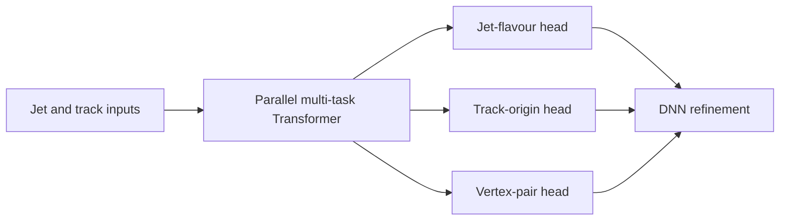
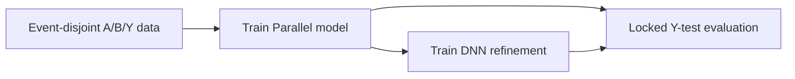

# SerialFlavour

SerialFlavour studies multi-task jet-flavour tagging with a GN2-inspired Transformer on ATLAS Open Data. The central question is whether track-origin and track-pair vertexing supervision can complement the main jet-flavour classification task, and whether their learned representations retain useful information for a lightweight downstream DNN. The repository therefore contains both the deployable Parallel model and a controlled frozen-feature comparison workflow.

## Project Architecture

```text
SerialFlavour/
├── src/
│   ├── config.py                Shared configuration and seed utilities
│   ├── data.py                  HDF5 loading and atomic caches
│   ├── losses.py                Multi-task loss definitions
│   ├── parallel_model.py        Parallel Transformer model
│   ├── training.py              Shared training utilities
│   └── parallel_refine/         A/B/Y frozen-feature refinement workflow
├── configs/parallel_refine/     Reusable components and experiment configurations
└── scripts/
    ├── compose_experiment.py    Compose experiment configurations
    ├── prepare_data.py          Prepare splits and processed caches
    ├── train_parallel.py        Train Parallel models
    ├── generate_cache.py        Generate frozen and graph caches
    ├── train_dnn.py             Train tabular refiners
    ├── train_graph_refiner.py   Train graph refiners
    ├── evaluate.py              Evaluate and aggregate results
    ├── run_parallel_refine_experiment.sh  Generic single-experiment runner
    └── production/              Experiment 1 EX production scheduler
```

`scripts/run_parallel_refine_experiment.sh` is the generic single-experiment runner. The coupled files under `scripts/production/` provide the multi-GPU production scheduler and should be deployed together.

## Model architecture

The Parallel model concatenates jet-level features to each track, encodes the track sequence with a shared Transformer, and applies three heads for jet flavour, track origin, and track-pair vertex compatibility. Attention pooling produces a global jet representation for the jet classifier and supplies context to the origin and vertex heads. The three heads share the same configurable MLP pattern while operating on jet-, track-, and track-pair-level inputs respectively.

The downstream comparison does not retrain the Transformer. It freezes the selected Parallel checkpoint, pools its prediction and representation features, and trains a tabular DNN on selected feature recipes, refining the performance of parallel model.


```mermaid
flowchart LR
    inputs[Jet and track inputs] --> parallel[Parallel multi-task Transformer]
    parallel --> jet[Jet-flavour head]
    parallel --> origin[Track-origin head]
    parallel --> vertex[Vertex-pair head]
    jet --> dnn[DNN refinement]
    origin --> dnn
    vertex --> dnn
```

## Workflow

The workflow uses event-disjoint A/B/Y splits. A-train and A-val train and select the upstream Parallel checkpoint. B-train and B-val provide the data for frozen-feature DNN readouts. Y-test remains locked for final evaluation of both the upstream model and each DNN recipe.

Input normalisation is derived from A-train only. The data preparation stage also applies the configured track selection and kinematic resampling, while the pair target follows the Open Data truth-vertex convention. This keeps upstream training, downstream fitting, and final evaluation separated.


```mermaid
flowchart LR
    split[Event-disjoint A/B/Y data] --> parallel[Train Parallel model]
    parallel --> dnn[Train DNN refinement]
    parallel --> evaluation[Locked Y-test evaluation]
    dnn --> evaluation
```

## Configurations and outputs

Experiment configurations in `configs/parallel_refine/` combine independent data, Parallel-model, and refiner components. The optional `experiment.markers` fields record an experiment label, tags, comparison group, and scalar variables in every generated manifest, so model/data variations can be identified without relying only on directory names.

The current experiment defaults use 100k jets for each A/B validation split, 200k for B-train, and 500k for the locked Y-test split. The default readout is `input → 128 → 64 → 32 → output`. Every configured Parallel seed is paired with all five downstream initialization seeds (`1`–`5`), so a standard five-Parallel-seed configuration trains and evaluates 25 refiner replicas per recipe, including graph recipes. Older `b500k/y200k` data components remain available only for reproducing earlier runs.

`refiner/dnn_default.json` selects `F1_embed`, `F3_embed_aux`, `F4_all`, `FG2`, `FG2s`, and `FG4`; `FG2s` is the one-layer variant of two-layer `FG2`. The generic runner reads `refiners.recipes` from the selected experiment at launch, so a new experiment JSON can add or remove any implemented recipe through `overrides.refiners.recipes` without editing the runner.

Result artifacts are kept separate for download and post-processing:

```text
<result-root>/<experiment>/
├── data/                              # data-stage manifest and resolved config
├── parallel/parallel_seed<p>/          # Parallel checkpoints and training artifacts
├── refiner/parallel_seed<p>/<recipe>/dnn_seed<d>/
└── evaluation/parallel_seed<p>/<recipe>/dnn_seed<d>/
```

The Parallel-only Y evaluation is stored at `evaluation/parallel_seed<p>/parallel/`. The configured split and feature-cache locations remain shared cache inputs; `data/data_preparation_manifest.json` records their exact identities and split hashes rather than duplicating those large files.

Each Parallel and refiner run saves checkpoints, JSON/CSV training histories, TensorBoard logs, and a run manifest. The final Y-test evaluation saves predictions and metrics for both models, jet probability and discriminant plots, auxiliary origin/pair diagnostics for the Parallel model, and DNN-versus-Parallel rejection comparison plots. Rejection ratios are evaluated at common target signal efficiencies, with each model setting its own score threshold.

### Loss objectives

Parallel uses `jet CE + 0.5 * origin CE + 1.5 * pair BCE` in the current components. Jet CE has fixed class weights `[2, 2, 1]` for b/c/light, matching the inverse of the configured sampling ratio `1:1:2`; weights are not recomputed from split counts. Origin CE uses its configured eight-class weights and ignores label `-1`; pair BCE excludes invalid, self and ignored track pairs.

Both tabular DNN and graph-DNN now use only weighted jet CE, inheriting `parallel.class_weights.jet_class_weights` from the resolved experiment. The same criterion drives training, B-val checkpoint selection, early stopping and learning-rate decay. Frozen origin/pair predictions remain inputs without auxiliary-label supervision. Resolved configurations, histories and run manifests record the loss and class weights. The existing `train_cross_entropy`/`val_cross_entropy` history fields now refer to weighted CE; probability metrics retain their ordinary unweighted CE alongside the separately recorded validation weighted CE.

Use a new experiment identity for weighted downstream runs. The derived loss is included in the resolved configuration hash, so historical unweighted results cannot be silently reused under the same experiment manifest.

### Learning-rate decay

The reusable Parallel and refiner components enable `ReduceLROnPlateau`, with initial LR `1e-3`, factor `0.5`, minimum LR `1e-5`, relative improvement threshold `1e-4`, and no cooldown. Parallel uses patience **8** and monitors A-val weighted jet cross-entropy; both tabular DNN and graph-DNN use patience **4** and monitor B-val weighted jet cross-entropy. In PyTorch, reduction occurs after more than `patience` consecutive epochs without a qualifying improvement. The schedule steps once after validation and affects all parameters in the stage's optimiser, including the upstream shared backbone and auxiliary heads.

Configure `lr_scheduler` in `parallel.training`, `refiners.dnn`, or `refiners.graph`. Set `enabled: false` to reproduce fixed-LR training; old standalone components with no scheduler field also retain fixed LR. Early stopping and best-checkpoint selection remain unchanged and are not reset when LR decreases. Histories record `lr` (used during the completed epoch), `lr_next` (after validation), and `lr_reduced`; TensorBoard records these under `optimizer/learning_rate`, `optimizer/learning_rate_next`, and `optimizer/lr_reduced`. Histories and run manifests also identify the scheduler configuration and validation metric.

Use a new experiment name for decay runs, such as `configs/parallel_refine/experiments/default_lr_decay.json`, to keep earlier fixed-LR outputs intact. The existing immutable experiment manifest rejects changed configurations in an old result directory. To isolate the two stages, create separately named experiments and disable the other stage's scheduler through experiment overrides:

```json
{
  "overrides": {
    "parallel": {"training": {"lr_scheduler": {"enabled": false}}}
  }
}
```

This fragment enables a downstream-only comparison when combined with the current components. For upstream-only decay, disable `lr_scheduler` in both `overrides.refiners.dnn` and `overrides.refiners.graph`. Keep the data, seeds, loss weights, initial LR, epoch limits and early stopping identical to the control. Select the protocol on A-val/B-val before evaluating locked Y-test; implementation and offline tests do not establish a tagging-performance gain.

Run the stages from the repository root:

```bash
python scripts/prepare_data.py --config configs/parallel_refine/experiments/default.json
python scripts/train_parallel.py --config configs/parallel_refine/experiments/default.json
python scripts/generate_cache.py --config configs/parallel_refine/experiments/default.json
python scripts/train_dnn.py --config configs/parallel_refine/experiments/default.json
python scripts/evaluate.py --config configs/parallel_refine/experiments/default.json
```

## Exploration directions

1. Under limited data, compare Transformer-only training with Transformer plus a frozen-feature DNN, including smaller Transformer backbones and matched total parameter budgets. A higher ceiling for the two-stage route would indicate that the readout contributes more than a simple capacity increase.

2. With a fixed Transformer architecture, vary the available training data and measure whether the DNN gain vanishes or persists. A persistent gain at large sample sizes would support the hypothesis that the main classification head and physics-motivated auxiliary tasks retain complementary information.

3. Sweep the multi-task loss weights and relate the downstream DNN gain to the upstream jet-classification optimum. This tests whether the DNN mainly recovers information sacrificed by a non-optimal main-task weighting, or adds value even when the upstream objective is well tuned.
