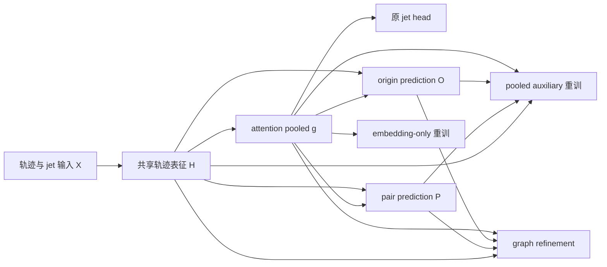

# 多任务训练后的 post-refinement：机制假设与实验设计

日期：2026-09-30。本文是研究讨论稿，基于当前论文初稿、项目实现与本地结果提出假设；这里设计的新增实验尚未执行。

## 1. 最值得回答的问题

我建议把研究问题收束为：**在多任务训练得到的冻结表征中，哪些与 jet flavour 有关的结构没有被原分类头充分利用？第二阶段通过改变训练目标、读出函数或轨迹聚合方式，如何使这些结构变得更容易使用？**

这个问题允许出现几种不同答案：收益主要来自重新训练分类头；来自辅助监督塑造的 shared representation；来自 pooled embedding 之外的轨迹信息；或者来自辅助预测提供了更合适的计算路径。这些机制可以共存，未必需要得出“辅助任务包含独有信息”的结论。

当前最优先的工作不是扩大模型搜索，而是建立三个层次的区分：

1. **上游辅助监督的作用**：origin/pair loss 是否改善、损伤或重新组织 shared encoder 的表征？
2. **冻结后的辅助读出的作用**：在同一个 checkpoint 上，加入辅助概率或图结构是否优于充分训练的 embedding-only 读出？
3. **两阶段训练的作用**：收益是否来自新样本、不同类别权重、更大的分类头、不同 checkpoint 选择或更长优化？

我的工作假设是：目前的 post-refinement 收益很可能由“分类目标与读出重训”及“结构化读取轨迹表征”共同构成；辅助预测相对于 pooled embedding 的严格条件信息增量，仍没有被现有分析证明。以下实验应允许这个假设被否定。

## 2. 现有证据与不能直接下的结论

### 2.1 本次阅读的材料

论文已阅读 [Introduction](/D:/hep_analysis/gn2_study/SerialFlavour-paper/sections/01_Introduction.tex)、[Method](/D:/hep_analysis/gn2_study/SerialFlavour-paper/sections/02_Method.tex)、[Results](/D:/hep_analysis/gn2_study/SerialFlavour-paper/sections/03_Results.tex)、[Discussion](/D:/hep_analysis/gn2_study/SerialFlavour-paper/sections/04_Discussion.tex)、[Conclusion](/D:/hep_analysis/gn2_study/SerialFlavour-paper/sections/05_Conclusion.tex)，以及 Abstract 和 TODO。Abstract 仍是占位内容；论文对规模趋势和机制已有明确待办。

本地证据重点来自：

- [Experiment 1 EX 工作点汇总](/D:/hep_analysis/gn2_study/SerialFlavour/local/results/parallel_refine_e1_ex/analysis/figures/line_plots/wp_rejection_summary_all.csv)与[100/0 基线绘图脚本](/D:/hep_analysis/gn2_study/SerialFlavour/local/results/parallel_refine_e1_ex/analysis/plotting/plot_rejection_log_100_baseline.py)。
- [Experiment 2 相对 F1 的读出比较](/D:/hep_analysis/gn2_study/SerialFlavour/local/results/parallel_refiners_e2/experiment2_analysis/experiment2_f1_embed_baseline_rejection_summary.md)与[逐 seed 增益汇总](/D:/hep_analysis/gn2_study/SerialFlavour/local/results/parallel_refiners_e2/experiment2_analysis/experiment2_f1_baseline_gain_heatmap_values.csv)。
- [Experiment 2 A=1M 汇总](/D:/hep_analysis/gn2_study/SerialFlavour/local/results/parallel_refiners_e2/experiment2_analysis/experiment2_p122k_a1m/experiment2_summary.md)、[A=2M 汇总](/D:/hep_analysis/gn2_study/SerialFlavour/local/results/parallel_refiners_e2/experiment2_analysis/experiment2_p122k_a2m/experiment2_summary.md)。
- [Experiment 1 CCA/probe 报告](/D:/hep_analysis/gn2_study/SerialFlavour/local/results/parallel_refiners_e1/embedding_probe/report.md)、[Experiment 2 CCA 与 block residual 报告](/D:/hep_analysis/gn2_study/SerialFlavour/local/results/parallel_refiners_e2/embedding_probe/report.md)。
- [项目推进记录](/D:/hep_analysis/gn2_study/SerialFlavour/local/to_report.md)。早期 Staged 与 truth-input 结果用于提出问题，不与目前控制更严格的结果合并统计。

本次复核了代码和已有汇总，未重新训练模型或重算完整测试结果。下文引用历史报告时保留其 split、seed 和 readout 的限制。

### 2.2 可以作为研究起点的现象

| 观察 | 当前支持的解释 | 尚未排除的解释 |
|---|---|---|
| DNN-o 只读 pooled embedding，也能改善 rejection | 原 head 没有充分利用冻结 embedding，或重训改变了分类偏好 | head 容量、类别权重、优化、数据与选择准则的变化 |
| DNN-a/FG2 在部分工作点优于 DNN-o | 辅助读出或结构化轨迹计算有实际用途 | 更多参数、不同 pooling、正则化和 seed 波动 |
| light rejection 改善，b/c 或 c/b 未同步改善 | 改善有类别和工作点选择性 | 三分类概率重映射、训练目标差异、尾部统计波动 |
| 分配最优点随数据量和 recipe 改变 | 上游表征学习与下游读出存在资源权衡 | A、B 同时变化；测试集选最优点导致乐观偏差 |
| 部分完整拼接 probe 改善，但新增 block 的线性残差近随机 | 新 block 可能提供联合使用的计算捷径或冗余表征 | probe 能力不足、残差定义不适合、样本量不足 |

初稿的 2M 总数据、80/20 分配、70% b efficiency 示例，相对同总量 100/0 Parallel 的 rejection ratio 为 DNN-o `1.065 ± 0.064`、DNN-a `1.098 ± 0.084`、DNN-g `1.200 ± 0.041`。这是论文已报告的五个配对 upstream-seed ratio 的均值与样本标准差，不是显著性证明。这里的 2M 是总选取数据；配置目标为 A-train=1.12M、B-train=0.28M、共享 validation=0.20M、test=0.40M，不能写成 A-train=2M。

Experiment 2 则回答不同的问题：固定 B、改变 A。其 CSV 中，122k 模型 FG2 相对 F1 的 b/light rejection 增益在 A=1M、2M、3M 分别为 `11.01% ± 11.31%`、`11.07% ± 14.37%`、`4.60% ± 14.79%`，正增益分别出现在 4/5、4/5、3/5 配对 seed。它提示变化值得研究，但三个点及较大 seed 波动不足以证明渐近收敛。该历史汇总的五个配对结果也不能自动改称当前 Cartesian 配置的 25 次独立训练。

尤其要保留两个边界：

- 初稿的 Data Size Scaling 图明确标注使用旧结果及映射基线，新结果有较大统计波动。不能据此把“辅助收益随规模消失”写成确立的规律。
- 两份 embedding probe 都在 B-val 上进行。Experiment 2 的 FG checkpoint 已在 B-val 上选择；即使 probe 做 event-grouped OOF，也没有消除此前 checkpoint selection 对整份 B-val 的依赖。这些是探索诊断，不是独立泛化证据。

### 2.3 实现中一个优先级很高的混杂因素

[上游训练](/D:/hep_analysis/gn2_study/SerialFlavour/scripts/train_parallel.py:132)使用 weighted jet CE；[122k 配置](/D:/hep_analysis/gn2_study/SerialFlavour/configs/parallel_refine/parallel/experiment1_p122k.json)的 jet class weights 为 `(2,2,1)`。但[下游 DNN](/D:/hep_analysis/gn2_study/SerialFlavour/scripts/train_dnn.py:129)与[GNN](/D:/hep_analysis/gn2_study/SerialFlavour/scripts/train_graph_refiner.py:133)调用的 `cross_entropy` 没有 class weight。

因此两阶段之间实际还发生了 **weighted CE → unweighted CE** 的变化。即使 A、B 的目标 flavour 比例相同，重训也可能改变 light 类偏好与三分类 discriminant 排序。这不是已证明的收益机制，但应先检查，否则很容易将目标变化解释成 representation 的进步。

历史 Experiment 2 A=1M 汇总中，Parallel accuracy 约 0.723，F1 约 0.808；这种明显变化尤其值得用类别权重与 confusion matrix 检查。Accuracy、概率校准、固定工作点 rejection 是三个不同问题，不能相互替代。

## 3. 用一个明确的数据流讨论机制

令原始输入为 X，jet flavour 为 y；冻结 encoder 产生轨迹集合 H={h_i}，attention pooling 产生 g；origin prediction 为 O，pair prediction 为 P。当前模型中 O_i 读取 `(h_i,g)`，P_ij 读取 `(h_i,h_j,g)`。辅助预测已经受全局上下文影响，不能视为三个独立传感器。

上游 joint training 改变 H、pooling 与三个 heads；post-refinement 冻结这些模块，只训练下游参数。下面所有信息论陈述均针对给定训练结果、固定模型、推理阶段的确定性变换。

### 3.1 “没有新增原始信息”与“补充 pooled embedding”可以同时成立

设辅助读出 U 是 `(H,O,P)` 的确定性函数。相对于完整输入 X，确定性 post-refinement 不可能增加 Shannon 信息；相对于压缩后的 g，却可能恢复可用信息：

$$I(y;g,U)\leq I(y;X),\qquad I(y;g,U)=I(y;g)+I(y;U\mid g).$$

关键是 U 未必是 g 的函数。g 是 pooled 摘要，而 U 可以访问尚未 pooling 的 H 与 pair structure。所有预测都来自同一上游输入，不意味着它们都由 g 唯一决定。

还要区分另一种情况：U 实际可以由 g 计算，但这个计算比当前下游 MLP 容易学习的函数更复杂。把 U 显式提供给小模型，仍可能提高有限数据下的表现。这里改善的是受模型能力与数据限制的可用性，而不是 Shannon 信息。Xu 等的 [usable information 理论](https://arxiv.org/abs/2002.10689)提供了直接相关的概念框架；它并不保证我们的具体 FG2 一定改善。

对于允许达到 Bayes 最优的、无权重 log-loss 分类器，有：

$$\inf_f\mathbb E[-\log f(y\mid g)]-\inf_q\mathbb E[-\log q(y\mid g,U)]=I(y;U\mid g).$$

这是总体分布下、足够丰富函数类的理想关系。有限 MLP、有限样本与优化误差下，两模型测试 CE 的差不能直接当作条件互信息估计；固定效率 rejection 的差更不能如此解释。该关系适合指导对照，不适合为当前结果提供“已证明的信息增量”。

### 3.2 DNN-a 的 pair-weighted embedding 实际改变了什么？

[cache 实现](/D:/hep_analysis/gn2_study/SerialFlavour/src/parallel_refine/cache.py:44)先计算有效非自环边的 normalized neighbour mean，再用原 attention weights 聚合：

$$m_i=\sum_{j\ne i}\alpha_{ij}h_j,\quad \alpha_{ij}=\frac{P_{ij}}{\sum_{k\ne i}P_{ik}},\quad v=\sum_i a_i m_i=\sum_j\beta_jh_j,$$

$$\beta_j=\sum_{i\ne j}a_i\alpha_{ij}.$$

有效邻边总权重为零时，代码输出零向量；以上等式在有权重的节点上成立。这说明 v 本质上是 H 的另一种数据依赖加权聚合，**没有显式保存每条边的身份**。DNN-a 还保留 attention-pooled pair mean/max/sum，因而不只是这个向量，但也不能称为完整顶点拓扑重建。

很具体的假设是：原 attention 容易集中于少量有强 displacement 信号的轨迹，pair pooling 将权重转移到与这些轨迹有共同顶点关系的其他轨迹。这是一种“关系引导的重加权”。可以比较 a 与 β 的熵、有效支持数 `1/sum(weight²)`，以及它们对 truth origin 类别的质量分配；这些 truth 只用于诊断。

### 3.3 FG2 的收益可能来自 topology，也可能来自重新读取 H

[FG2 实现](/D:/hep_analysis/gn2_study/SerialFlavour/src/parallel_refine/graph_refiner.py:116)对 frozen h_i 做可训练投影，用 directed P 的 incoming/outgoing 消息更新两层，再做 mean+max pooling，拼接 `(g, pooled O)` 交给 DNN。它没有显式合并节点成顶点，也不是 DiffPool。

与 F1 比较时，FG2 同时获得了未 pooling 的 H、新的逐轨迹非线性变换、另一种 pooling、origin context、pair edges 和更多参数。**只有 pair-edge 对照才能把其中的收益归因于学到的顶点关系。** 代码的 pair head 未强制 P_ij=P_ji；同顶点 truth 对称，预测可能不对称。对称化是可检验设计，而不是自动正确的修复。

## 4. 机制假设：怎样支持，怎样反驳

| 假设 | 预期结果 | 能削弱或反驳它的结果 | 首选实验 |
|---|---|---|---|
| H1：类别权重与概率重映射解释较多收益 | logits-only 校正或统一 CE 后，F1/native 差明显缩小 | 统一目标后，强 F1 和辅助增量仍稳定 | E1 |
| H2：原 head 容量或优化不足 | 同宽度 head 重训已有收益；加深 embedding head 后趋于饱和 | 同样强的 head 在端到端训练中仍无法达到两阶段结果 | E2 |
| H3：辅助监督改善 shared representation | 有辅助监督的 g/H 在匹配读出下优于 jet-only encoder | 读出、预算统一后 jet-only 同样好或更好 | E3 |
| H4：辅助监督牺牲主任务易读性，但保留了可再利用结构 | 原 head 变差，F1/FG2 重训后恢复或超过；与梯度诊断相呼应 | 冻结后所有强读出都变差 | E3、E4 |
| H5：auxiliary 是 g 的有用计算捷径 | 从 g 预测 U 的 surrogate 可替代真实 U；小 probe 获益更明显 | surrogate 无法替代，且 U 稳定提升强读出 | E5 |
| H6：pooling 丢失了任务相关结构 | 无 pair 的 trainable set readout 也胜过 g-only | 匹配容量下 set readout 无收益、真实 P 才有效 | E6 |
| H7：pair topology 与节点身份的对应关系重要 | 真实边优于边重排、均匀边与无边；拓扑分组效应合理 | 重排边同样好，或 n_tracks/statistics 足以替代 | E6、E7 |
| H8：收益集中于背景尾部/特定物理子群 | 被移出 signal-like 尾部的 light jets 有稳定物理特征 | 全是少数事件或随 split/seed 翻转 | E8 |
| H9：两阶段通过新样本与固定 encoder 减少共适应 | 独立 B 明显优于等量 A 子集，跨 split 可复现 | 相同样本重训同样好；统一优化后差异消失 | E9 |
| H10：多尺度/多视角表示比单个 g 更适合 tagging | 小型多池化或分组 readout 比更大 g-head 更高效 | 收益由参数量解释，或引入新 nuisance 敏感性 | E10 |

这些是可以同时成立的假设。应先排除简单解释，再评估更强机制；“某项实验没有检测到增量”也需要样本量和 probe 能力的限定。

## 5. 最先执行的两个实验：训练目标与分类头

### E1：把类别权重、logit 校正与真实表征收益拆开

**问题：** 不访问新 embedding，仅对 native logits 做简单重映射，能解释多少收益？

固定一个现有 upstream checkpoint，先用 B-train 拟合以下低成本模型，在 B-val 选参数；最终在预留确认集报告四种 rejection、无权重 CE、Brier score、classwise calibration 和 confusion matrix：

1. 原始 native probabilities。
2. 不训练任何参数，按上游权重执行 `p'_k ∝ p_k/w_k`。
3. 一个 temperature 参数；再做带 class bias 的低维 logit 校正，必要时比较 regularized vector/matrix scaling。
4. 只读三个 native logits 的小 MLP。
5. F1 分别用 weighted 与 unweighted CE 训练；二者使用相同初始化、batch 顺序、优化预算。
6. 选定一个辅助读出，再做同样的 CE 对照。

若训练分布的真实条件概率是 η_k，weighted CE 的总体最优预测满足：

$$p_k^{(w)}(x)=\frac{w_k\eta_k(x)}{\sum_jw_j\eta_j(x)}.$$

因此除以 w 是一个有理论动机的诊断。但实际模型不一定达到最优，训练还有 flavour/kinematic resampling，训练与评价分布也未必一致；简单校正不能保证还原 evaluation posterior。

**必须注意：** 对最终一个标量 discriminant 做严格单调变换，不会改变排序，因此不会改变同样 tie 规则下固定 signal efficiency 的 rejection。可是三分类 temperature scaling 后重新计算 `D_b=log[p_b/(0.2p_c+0.8p_light)]`，通常不是旧 D_b 的单调函数，所以可能改变 rejection。不能将“单调变换 ROC 不变”误用到整个三分类概率校准过程。[Guo 等的校准工作](https://proceedings.mlr.press/v70/guo17a.html)可用于选择简单基线。

**判读：** 若 logits-only 已解释主要改善，论文应强调目标与决策边界重训，并报告剩余辅助增量。若统一 CE 后 FG2 相对强 F1 仍稳定改善，才进入结构解释。校准改善本身不证明物理信息恢复。

### E2：原分类头到底弱在哪里？

在相同 g、B、CE 和选择规则上比较：linear softmax → `48→16→3` → 现有 `48→128→64→32→3` → 一个预先限定的更大 embedding head。记录训练/验证曲线、参数量与时间，避免只比较最终最好分数。

同时对 native-sized head 做两种初始化：复制 native head 后继续训练；重新随机初始化。统一 embedding normalization，或把 normalization 作为单独开关，否则额外收益还包含输入条件数变化。

再做两个必要对照：

- **上游端到端强 jet head**：保留辅助 heads，使用与 F1 接近的 jet head，统一 CE。比较是否能直接缩小两阶段收益。
- **容量匹配 g-only 模型**：用只读 g 的 MLP 接近 DNN-a/FG2 的参数预算，同时报告不同计算结构，不能把参数匹配当作所有成本已匹配。

把 native→F1 的收益称为“embedding readout gain”，把强 F1→auxiliary 的收益称为“auxiliary readout increment”。这两个差值是操作性分解，使用相同 checkpoint 时最有解释力，不应强行宣称两个机制相互独立。

## 6. 辅助训练怎样塑造表征？

### E3：辅助监督 × 下游读出的因子实验

第一轮只训练四个 upstream 条件：`(λ_origin,λ_pair)=(0,0),(0.5,0),(0,1.5),(0.5,1.5)`。每个条件评估 native、强 F1、无 pair 的 set readout，以及可解释的辅助读出。

关掉某个辅助 loss 后，该 head 的预测不能继续当作有效 auxiliary signal。`λ=0` 的 head 即便参数存在，也不应使用其随机/无监督输出来做“辅助无用”的证据。若需要在不同 encoder 上统一比较 P/O 的可解码性，可单独训练诊断 heads，使用 A 内训练事件、固定 encoder，并明确这是新增监督路径。

这个矩阵能回答三个问题：

- 有辅助监督的 encoder，其 g 在同样强读出下是否更好？这是辅助监督的表征贡献。
- 有辅助监督的 encoder，其 H 在无 pair set readout 下是否更好？这检查 pooled g 是否掩盖了轨迹层收益。
- 对同一 encoder，加入有效 P/O 是否继续改善？这是冻结后的辅助读出贡献。

第二轮再小范围探索权重：origin `{0,0.2,0.5,1.0}`、pair `{0,0.5,1.5,3.0}`。先用较小 backbone 与少量 seed 筛查，再按固定规则对 122k 和多个 seed 确认。比较**绝对性能、auxiliary 增量和 refinement gap 三张表**：大 gap 可能只是 native 很差；gap 变小也可能是 frozen representation 更差，而不是权重更优。

Royer 等 [Scalarization at Scale](https://arxiv.org/abs/2310.08910)为研究权重、模型规模与搜索效率提供参考。不同领域的经验不能保证这里的小模型最优权重会转移到大模型。

### E4：梯度互动与训练时间尺度

在固定训练 batches 上，分别记录每层 shared encoder 的 `∇L_jet`、`∇L_origin`、`∇L_pair`：两两 cosine、梯度范数与乘上 λ 后的范数。按训练早期、中期、后期及 n_tracks/jet flavour 分组。loss 数值大小不等于梯度影响大小，pair 条目很多也不等于独立监督样本很多。

对 SGD 的局部近似，辅助梯度对主任务 loss 的一步贡献约为：

$$\Delta L_{jet}\approx-\eta\,\nabla L_{jet}^{\top}(\lambda_o\nabla L_o+\lambda_p\nabla L_p).$$

这是局部、小步长的一阶诊断。实际 AdamW 有预条件、动量和 weight decay，应另外记录主任务梯度与实际参数更新的内积。负 cosine 不自动证明长期负迁移；两个任务也可能通过不同方向保留最终可联合使用的信息。[PCGrad](https://arxiv.org/abs/2001.06782)可作为后续优化干预对照，不能仅凭 cosine 图就宣布它必要。

训练干预优先选两个简单版本：全程 multi-task vs 前期 multi-task、后期仅 jet；在相同总更新步数下比较 native、F1、FG2。若后期 jet-only 提高 native、同时削弱 FG2 增量，可能支持“原 head/目标与辅助结构之间存在读出张力”。也可能只是更长的主任务优化，需要等步数的全程 jet-only 对照。

可缓存若干预定 epochs 的 H/g/P/O，在固定 B 上训练相同 probe，画 native 与强 readout 随 epoch 的曲线。若最优表征 checkpoint 早于 native-CE 最优 checkpoint，说明当前 checkpoint selection 也参与了现象。checkpoint 选择必须在 validation 上完成，不能用测试曲线挑 epoch。

## 7. 辅助读出提供了什么：条件信息、计算捷径与图结构

### E5：从线性 non-overlap 转向条件预测

现有 CCA 已经做了有价值的筛查，但下一步不宜只增加 CCA 图。低相关方向可以含有另一表示的非线性变换；高相关方向也不保证在当前数据量下同样容易读取。CCA/CKA 衡量表示关系，并不直接回答辅助特征在给定 g 后还能改善多少 flavour 预测。[Kornblith 等](https://proceedings.mlr.press/v97/kornblith19a.html)讨论了表示相似性度量的性质和限制。

推荐将 U 分别取为 pooled origin、pair-weighted embedding、pair statistics、FG2 graph embedding，做以下互相补充的实验。

**第一步：直接比较条件读出。** 在完全相同的 folds、优化预算和调参规则下，比较 `f(g)` 与 `f(g,U)`。至少使用 linear probe 和小 MLP 两种能力等级，同时设置更强的 g-only 对照。主要机制指标为 held-out 无权重 CE 差；rejection 保留为应用指标。如果额外 U 只帮助 linear、小样本或小 MLP，而强 g-only 模型逐渐追上，更符合计算捷径或样本效率的解释。

**第二步：预测辅助表示。** 只用训练 events 拟合 `q(g)≈U`，从 ridge 开始，再用小 MLP。比较 `f(g)`、`f(g,q(g))`、`f(g,U)`。`q(g)` 是 g 的确定性变换，因此它若解释了大部分增益，就为“重新组织已有表征”提供实验证据。记录 held-out reconstruction error，并分 block 报告，避免高方差但无 flavour 用途的坐标主导误差。

**第三步：条件残差。** 构造 `r=U-q(g)`，比较 `f(r)` 与 `f(g,r)`。训练样本上的残差也必须由 event-grouped cross-fitting 生成，不能先在全部训练数据拟合 q，再把过拟合后的残差交给 probe。所有标准化、投影、正则化选择均只用对应训练折；OOF surrogate 与测试 surrogate 的拟合规模差异要记录，必要时用独立的 q-fit/probe-fit 分区复核。

**为什么残差单独近随机不够？** 设 g 与 U 是两个独立二元变量，y 为二者的 XOR。单看任何一个变量都无法分类，联合后却能完美预测。这说明 `f(r)` 的失败不能代替 `f(g,r)` 的检查。反过来，残差可分类也可能只是 q 拟合不充分，并不自动证明独有信息。

**第四步：必要的负对照。** 比较 `[g,g]`、维数匹配的随机投影/固定随机非线性变换、与真实 U 同维的独立噪声。所有扩维模型需要匹配正则化搜索范围。它们检查拼接增益是否只来自增加计算路径、改变隐式正则化或 probe 调参差异。

FG2 graph embedding 本身经过 jet-label 监督。若导出训练样本的 FG2 embedding 后训练第二个 probe，必须承认它含有第一阶段监督拟合的影响。要做严格比较，应使用未参与 FG2 训练与 checkpoint 选择的 probe 数据，或在外层 folds 内重新训练 FG2。已有 B-val 图 embedding 的 OOF probe 只能保留为探索诊断。

**可接受的结论强度：** 若真实 U 在多个能力等级、seed 和独立确认集上都有条件增量，而 q(g) 无法替代，可以说“在所测试函数类和样本规模下存在不能由 g 的读出解释的增量”。有限模型实验仍不能证明任意非线性函数都无法恢复 U，也不能直接测出严格的 unique information。

### E6：FG2 是否真正使用了 pair topology？

固定 upstream H/O/P、下游 context `(g, pooled O)`、优化协议及 seed。主要对照在 B-train 和 evaluation 中采用一致的输入变换，并重新训练下游模型：

| 图或集合输入 | 保留什么 | 主要回答什么 |
|---|---|---|
| 可训练逐轨迹 MLP + mean/max，完全不读 P | H、逐轨迹非线性、pooling | 重新读取 H 是否已足够？ |
| FG2 架构，所有非自环边置零 | 节点路径、原更新模块、pooling | 额外节点计算与残差路径的贡献 |
| 有效非自环边全部置为相同正值 | 全局消息混合、节点数 | 学到的边权是否优于均匀混合？ |
| 对每个 jet 的有效边权随机重排 | 边权直方图、H | 哪些轨迹互相连接是否重要？ |
| 仅 P 做 `ΠPΠᵀ`，H/O/context 保持原顺序 | 图的结构和边权，破坏节点对应 | topology 与节点语义的对齐是否重要？ |
| 完整同步置换 H/O/P/mask | 同一个图的重编号 | permutation invariance 的实现 sanity check |
| `(P+Pᵀ)/2`、原 P | 对称关系、原有向预测 | 不对称部分是否有用？ |
| 原 FG2 | 全部现有输入 | 对照锚点 |

“边重排”并不自动保持每个节点的 degree；`ΠPΠᵀ` 保持图整体结构，却把 degree 分配到不同的节点。若要进一步声称“超出 degree 的 topology 起作用”，需要增加度分布/边际近似匹配的重连对照，并验证实际保持了哪些统计量。不能把不同 permutation 操作统称为“保留拓扑”。

测试时临时破坏边、不重新训练，可以测当前模型对边的依赖，但性能下降也可能来自分布外输入。建议把这类 sensitivity 图放在重新训练的对照之后。

当前消息层按出入度归一化；在所有相关 degree 均未触及数值下限时，将同一 jet 的所有 P 乘以同一个正数，归一化 adjacency 不变。因此“整体降低 P 的幅度”可能根本不是有效干预。应检查实际归一化后的 adjacency，使用重排、均匀化或 `sigmoid(logit(P)/T)` 等确实改变相对边权的变换；temperature 参数只在 validation 上选择。

同时报告 H-only set readout 的参数与时间。若无 P 的 set readout 已追平 FG2，机制更可能是 pooling/轨迹读出；若真实边稳定优于所有匹配控制，再把重点转向关系结构。

### E7：辅助预测的准确率是否等于下游价值？

未必。pair 任务中占比大的简单关系可能主导平均指标，而决定 heavy/light 混淆的少数 displaced tracks 可能更重要。高 pair AUC 也不保证概率数值适合消息传递。

对同一个 upstream checkpoint，可做不改 encoder 的 controlled interventions：

- origin：soft posterior、argmax one-hot、temperature scaling；比较是否依赖 soft uncertainty。
- pair：原概率、对称化概率、若干预定阈值的二值边；记录信息压缩与稀疏化同时发生，不能将变化只归因于“去噪”。
- 分层 perturbation：按预测 origin、track displacement 或 pair confidence 定义干预组，破坏不同组的边；分组规则先固定。
- truth-oracle 诊断：用 truth origin/pair 替换相应输入，并重新训练下游模型，保持其余输入一致。truth 只用于机制上限探索，不能用于可部署模型的输入或模型选择。

truth 替换结果也不是严格性能上界。truth mask、目标定义、噪声和 soft predictions 的分布不同；辅助预测还可能携带 flavour-correlated 置信度。truth 关系不一定足以概括 tagging 所需的全部结构。例如 same-vertex 任务不直接描述两个顶点之间的 b→c 衰变关系。

较有意义的发现会是：整体 pair AUC 的提升与 rejection 无关，但特定 displaced-track 关系的质量与下游增益相关，并且针对这些关系的干预会降低收益。这仍属于模型机制证据；单纯相关性或 feature perturbation 不足以证明物理因果关系。

## 8. 为什么收益集中于 light rejection？

### E8：从平均指标转向相同 jets 的排序变化

在同一评价事件集合上，比较 native、强 F1、auxiliary 模型对每个 jet 的 `D_b`、`D_c`、三个 logits 与类别概率。固定工作点时，各模型使用自己的 signal threshold；记录实际通过的 signal 数和 background 数，而不只记录 rejection ratio。

重点看两类集合：原模型把 light jet 放入 signal-like 尾部、refiner 将它移出的事件；以及相反方向的事件。对两组比较 n_tracks、pT、η、impact-parameter significance、预测 origin 组成、pair-edge statistics；若已有相应 truth，再分析重味强子、secondary vertices、fake/pileup 等来源。不能假设当前缓存已有所有物理标签。

更具体的物理猜想是：可靠的“多条轨迹共同支持 displaced decay”比单个大 impact parameter 更能抑制偶然 signal-like 的 light jets；但 b 与 c 都可能具有 displaced structure，因此同样的读出不一定改善 b/c。另一种解释是模型只调整了 heavy-vs-light 的概率尺度。E1 与 E6 可以区分这两种方向。

建议输出三类图：

1. native→F1→FG2 的背景通过数与同事件迁移表；区分新增/移出的背景，避免只看净收益。
2. 预定物理分组中的 signal/background efficiency 和增益；同时给每组事件数。
3. classwise reliability、pairwise 排序和原三分类 mixture discriminant 的比较。

阈值附近的条件平均很容易受选择偏差影响。例如只研究“被修正的 jets”，自然会看到某些变量富集；应与固定 flavour、pT、η、n_tracks 区间内的完整样本比较，并在另一批事件复核。分组中尽量同时报告固定全局阈值的表现和分组内 ROC，前者反映实际选择，后者帮助区分分布组成与排序能力。

概率意义也需要明确：当前 discriminant 使用固定的背景混合系数，weighted/resampled 训练产生的 posterior 未必对应评价分布。因此某个 mixture 上表现改善，不等于所有二分类边界都改善。对各组 prior 与 loss weighting 的变化做记录，有助于解释 light rejection 与 heavy-flavour confusion 的权衡。

## 9. 第二阶段的数据为什么有用？

### E9：把固定 encoder 的 B-size 实验与 A/B 分配实验分开

**问题一：给定 encoder，多少 B 数据足够？** 使用同一个 checkpoint，建立 event-disjoint 的固定 B master pool，用 nested subsets，例如 50k、100k、200k、400k jets 的目标规模；按完整 event 取样并记录实际 jet 数。固定 validation 与确认集，分别训练 F1、set readout、FG2。每个 B-size 的标准化仅在该 B-train 上拟合。

如果强 F1 更早饱和、FG2 随 B 增长继续改善，这支持更复杂结构读出的样本需求解释。如果 FG2 只在很小 B 有优势、随后 F1 追上，更符合有利归纳偏置/样本效率的解释。两者都不能单独推出 Shannon 信息是否不同。

**问题二：独立 B 本身是否重要？** 比较冻结后在独立 B 与等量 A-train 子集上重训同一 head，匹配样本数量、flavour/kinematic sampling、CE 与优化预算。A-subset 属于 upstream 见过的数据，这个差异正是实验变量；encoder 对 A 的拟合可能使特征分布不同。再增加直接继续端到端训练的对照，帮助分清冻结与新样本的作用。

**问题三：固定总数据下，资源怎样分配？** 在前两项理解后，再沿 `n_A+n_B=N_train` 比较完整两阶段 pipeline，与看到全部训练池的单阶段模型比较。至少同时报告：固定数据预算、固定训练计算预算、固定推理成本三种约束中的哪一种。它们不能靠一张 rejection 表互相替代。

可以用一个启发式模型组织结果：

$$E(n_A,n_B)\approx E_\infty+a n_A^{-\alpha}+b n_B^{-\beta},\qquad n_A+n_B=N_{train}.$$

若暂时忽略两阶段耦合，内部最优点满足：

$$a\alpha n_A^{-\alpha-1}=b\beta n_B^{-\beta-1}.$$

它表达“把下一份训练数据给边际收益更高的阶段”。这是分析假设，不是已验证 scaling law；H 的质量会改变下游系数，rejection 又是尾部非线性指标。应优先对稳定的 held-out CE 拟合并检验，再看是否解释工作点趋势。现有少量数据点不足以可靠同时拟合多个指数。

另外一个容易遗漏的原因是：多任务 loss 提供了大量 track/pair 监督，但标签彼此相关，同一 jet 内的 pair 数并不等于有效样本数。把辅助 supervision 当作“更多独立数据”会夸大其统计效用。多任务表示学习理论可以支持共享结构降低学习成本的可能性；这里三个层级任务共享同一 jet，与经典独立任务样本的假设并不相同。[Maurer、Pontil 与 Romera-Paredes](https://jmlr.org/papers/v17/15-242.html)是可作为理论背景的来源。

## 10. 怎样得到更好的 representation learning？

“更好”应先定义：是更小 head 也能读取、更少 B 数据达到同样性能、跨 working point 更稳定，还是换物理分布后保持收益？这些目标未必一致。建议依次尝试以下改进，每次由对应机制实验决定是否继续。

### E10：在 pooling 前后增加有解释力的结构

**A. 多种 pooling 的最小组合，优先级最高。** 保留 g，再拼接 H 的 masked mean、max 和 track count，必要时加入一个小的 learned set pooling。控制输出维数和 classifier 参数。它直接检验“单个 attention summary 是否过窄”，也提供比 FG2 简单的 H-only 基线。[Deep Sets](https://arxiv.org/abs/1703.06114)提供 permutation-invariant 读出的建模框架；它不意味着当前有限维 mean/max 能无损保存所有集合结构。

**B. origin-conditioned pooling。** 使用预测 origin posterior 对 H 分组软聚合：

$$z_k=\frac{\sum_i O_{ik}h_i}{\epsilon+\sum_i O_{ik}},\qquad c_k=\sum_i O_{ik}.$$

将各组 z_k 与 c_k 一起保留；只有归一化均值会丢掉数量信息。优先比较少量有物理含义的组与全部八类。以 learned multi-head pooling、随机 soft assignment 和维数匹配 g-only 为控制，避免把单纯的多池化效果称为 origin semantics 的贡献。预测 O 已读取 g，因此分组不是独立测量。

**C. 显式关系摘要。** 对有效非自环边，聚合 `P_ij φ(h_i,h_j)`，或将对称节点组合、不同预测 origin 的 pair mass 形成 compact readout。与现有 pair-weighted mean 比较，判断学习边端点组合是否比再次平均 h_j 有效。先保留二体交互，只有 E6 支持拓扑作用时，再考虑软顶点 grouping、谱摘要或高阶结构；这些方法增加了假设与计算成本。

**D. 保留计数与边强度。** FG2 的 degree normalization 和 mean pooling 会弱化某些绝对尺度信息，max pooling 又偏向极端节点。可显式拼接 n_tracks、soft origin counts、pair mass/degree summaries，并用单独小模型测试这些统计量能解释多少收益。如果简单计数就足以替代复杂图模块，方法应相应简化。

图表示的理论不能为当前结构赋予过强能力。[How Powerful are Graph Neural Networks?](https://arxiv.org/abs/1810.00826)研究了 neighborhood aggregation 的表达能力及限制；当前 directed weighted、mean/max readout 的 FG2 不是该论文中所有表达能力结论的直接实例。尤其两层 message passing 的提升不等于已经学会显式顶点个数或衰变链。

### E11：让新的 jet representation 更容易被小 head 使用

**A. CE 加 supervised contrastive loss。** 在 jet-level projection 上加入适度的同 flavour 聚合、异 flavour 分离约束，比较 linear readout、B-size 学习曲线和各工作点 rejection。[Supervised Contrastive Learning](https://arxiv.org/abs/2004.11362)给出这种目标的标准实现思路。物理上同一 flavour 内有不同衰变拓扑和运动学分布，不宜强迫所有子群塌缩到一个紧簇；先从小权重开始，并查看 subgroup 性能。

**B. 任务专用的小 adapter。** 在 shared H 后为 jet/origin/pair 增加少量独立参数，再比较完整共享模型。若 E4 显示某些层长期存在有害竞争，可只在这些层分支。代价是增加参数和潜在信息分离；必须重新匹配强 jet-head baseline，而不是默认更多分支更好。

**C. 将 auxiliary-rich teacher 蒸馏到 g-only student。** teacher 使用 H/P/O，student 只读 g。采用 CE 加 soft-target distillation，比较原 F1 与蒸馏 F1。如果 student 能恢复 teacher 的大部分收益，说明这部分能力可在 g-only 路径中学习；若失败，可能是 student 容量、训练数据或 g 的信息限制，不能直接断言信息丢失。[Hinton 等的知识蒸馏](https://arxiv.org/abs/1503.02531)是方法来源。

teacher 对 student 训练数据的 soft targets 应来自未用这些事件训练或选择的 teacher，或使用外层 cross-fitting；直接用 teacher 的训练集预测可能把记忆效应蒸馏给 student。第二步才考虑让 student 更新 encoder/pooling，使最终 g 也能承载 teacher 的结构读出能力。此时目标已从 frozen post-refinement 转为新的表示训练方法，需要单独报告。

**D. 学习对分类有用的辅助信息，而非一味优化辅助平均准确率。** 如果 E7 表明只有部分 origin/pair 错误影响 tagging，可以在训练时调整这些结构的权重，或让少量主任务梯度更新辅助 readout。先保留独立验证的辅助质量指标，防止 auxiliary 失去物理语义而成为另一条隐藏的 jet classifier。

目前最推荐 A 类 pooling/计数对照与 g-only distillation：前者成本低、能判断是否需要 graph；后者直接检验复杂读出是否可被简单部署路径吸收。contrastive loss 和任务分支适合在机制有证据之后展开。

## 11. 统计设计与结论边界

### 11.1 两个 baseline 回答不同问题

固定 checkpoint 下，F1 与辅助模型的配对差回答读出机制。相同总数据下，80/20 的完整两阶段系统与 100/0 Parallel 的差回答训练策略的效用。二者都应保留；跨分配时 encoder、训练样本和训练目标均可能改变，不能用后一种差直接衡量辅助信息。

当前五个 upstream × 五个 downstream 的配置，设某指标为 R_sd。先计算每个 upstream 下的 downstream 均值 `R̄_s`，再对配对差或 ratio 在五个 upstream 上汇总。保持与论文一致的配对 ratio 定义，不能以 ratio of means 替换 mean of paired ratios。若历史结果只有五个配对运行，则按实际 manifests 报告；不补想象中的 downstream 重复。

### 11.2 分开报告训练变异与测试事件不确定性

- upstream/downstream seed 描述训练随机性。五个 upstream 的样本 SD 不是置信区间，25 个下游结果也不是 25 个独立 encoder。
- 同一批 jets 上的 rejection 还受有限背景事件数影响。用 event-cluster bootstrap 对模型进行同步重采样，保留同事件 jets 的依赖和模型间配对。
- 固定 signal efficiency 的 ROC 评估，在 bootstrap 中应重新求每个模型的 signal threshold；如果报告 validation 上预先冻结的部署阈值，则保持阈值固定并报告实际测试效率。这是两种不同 estimand。
- 同时给出背景通过数。若 background pass=0，报告相应界限与计数，不把无穷 rejection 纳入普通均值。

用于估算量级：若 N_bg=100,000、R≈1,000，只有约 100 个背景通过；独立计数的相对标准误差量级约为 `1/sqrt(100)=10%`。实际 event correlation 和阈值估计还会改变误差。小幅 auxiliary 增量可能首先受评价统计量限制，不能只靠增加训练 seeds 解决。

### 11.3 validation 的用途要明确

所有 feature transform、head 宽度、edge temperature、A/B allocation 与 working point 主次都在训练/validation 阶段固定。若现有 Y 已反复用于挑选想法，它可继续用于历史探索，却不能在机制确认时重新被称为“从未使用的测试集”。尽可能保留一批新的 event-disjoint 确认数据；若暂时没有，就明确结果仍为探索性，并冻结后续比较规则。

共享 A/B validation 本身不等于训练标签泄漏到 test，但它意味着两个阶段的 checkpoint 选择依赖同一批事件。不能把在这份 validation 上做的 probe 当作独立验证。新机制实验可另留 probe-validation，或采用外层 event-grouped folds。

建议预先指定 b/light@70% 为一个主指标，同时完整报告 b/c@70%、c/b@30%、c/light@30% 与 b/light@85% 等次指标，避免只保留最有利工作点。seed 数少时重点展示逐 seed 配对变化、效应量及不确定性；大网格里挑最优点后再给一个未经选择校正的显著性数字，解释价值有限。

### 11.4 nuisance 与外推

在 pT、η、n_tracks、pileup proxy 等分组复核收益；如果变化只来自某个运动学区间，需要先解释该区间的构成。若有不同 process、generator 或 detector condition 的样本，再做冻结模型的 transfer 检查。没有这些数据时，把跨域机制保留为假设。

不建议第一步就用 adversarial loss 强行移除 pT/η 信息：其中可能包含 tagging 所需的真实规律。先检测依赖及跨分布稳定性，再决定是否需要不变性约束。

## 12. 按成本和辨识能力安排下一轮工作

### 第一轮：复用现有 checkpoint，优先解决最强替代解释

| 优先级 | 工作 | 需要新增 upstream 训练？ | 完成后能作的判断 |
|---|---|---|---|
| P0 | E1：logits-only、权重校正、CE 统一 | 否 | 目标变化能解释多少收益 |
| P0 | E2：native-sized head 重训与强 F1 | 否；端到端强 head 留至下一轮 | head/优化是否已足够 |
| P1 | E6：H-only set、零边、均匀边、真实边 | 否 | 是否需要 pair structure |
| P1 | E5：g→U surrogate 与条件读出 | 否；严格 FG2 probe 可能需重训下游 | 计算捷径能解释多少增量 |
| P1 | E8：同事件排序与背景尾部分析 | 否 | 哪些 jets 获益，是否对应物理结构 |

先在一个清楚定义的 122k 条件做探索，例如固定已有 checkpoint 的 Experiment 2 A=1M、B=200k 配置；精确样本数以 manifests 为准。筛查可用两个 upstream seeds、每个三个 downstream seeds，结果只用于决定保留哪些对照。确认阶段恢复五个 upstream，沿用五个 downstream 或事先固定的重复数，并评估新增确认集。若 primary 增量方向不稳定，先查计数、目标和 seed variance，不急于添加新模型。

### 第二轮：辨认辅助监督与数据阶段的作用

E3 的四个 upstream loss 条件，加上一个端到端强 jet-head 条件；每个条件读出 native、强 F1、H-only set 和一个第一轮胜出的 auxiliary readout。训练过程中顺带记录 E4 的少量固定 batches 梯度，避免事后再完整重训。

随后执行 E9 的 nested B-size 与 A-subset/B 对照。只有在统一读出后确实看到 auxiliary-training 作用，再扩大 λ 网格、model size 和 data size。对于模型规模比较，尽量控制输出 embedding 宽度；原 56k/122k 的 g 分别为 32/48 维，不能把差异全归因于总参数量。

### 第三轮：由结果选择一种表示改进

- 若 E1/E2 已解释主要收益：改进原 jet head、CE 与训练流程，保留 post-refinement 作为简单有效的训练策略。
- 若 H-only set 已追平 FG2：优先改 pooling，减少复杂图模块。
- 若真实 P 明显优于匹配边对照：发展 origin-conditioned pooling 或显式关系 readout，并增加物理子群证据。
- 若 surrogate/distillation 能恢复增益：研究如何把辅助计算吸收到紧凑 jet representation 中。
- 若残余增量只在小样本稳定：将贡献定位为有限数据下的归纳偏置与样本效率，并用学习曲线支持。

这条路径的停止规则是：每一步需要改变下一步的研究选择。一个模型只提高分数、却没有排除任何机制解释，应放在方法性能探索中，不替代机制对照。

## 13. 哪些理论可以支撑论文，支撑到什么程度？

| 理论或文献方向 | 本项目可以借用的内容 | 不能由此直接推出 |
|---|---|---|
| 数据处理不等式与 conditional entropy | 区分 X、完整 H、pooled g；说明 auxiliary 相对 g 可能有增量 | FG2 一定包含严格独有信息 |
| [Usable information](https://arxiv.org/abs/2002.10689) | 计算可以让信息对受限读出更易用 | 用 rejection gain 直接量化互信息 |
| [多任务表示学习理论](https://jmlr.org/papers/v17/15-242.html) | 共享结构可能降低表示学习的统计成本 | 三个相关层级任务必然正迁移 |
| [PCGrad](https://arxiv.org/abs/2001.06782)与梯度诊断 | 构造辅助梯度干预，观察训练冲突 | 负 cosine 必然导致泛化损伤 |
| [Scalarization at Scale](https://arxiv.org/abs/2310.08910) | 权重与模型容量的系统比较、搜索动机 | 小模型最优权重无需验证即可迁移 |
| [Representation/classifier decoupling](https://arxiv.org/abs/1910.09217) | 表征与分类器分阶段学习的相关经验 | 长尾图像结论已证明 jet-tagging 机制 |
| [Deep Sets](https://arxiv.org/abs/1703.06114)与[GNN 表达能力](https://arxiv.org/abs/1810.00826) | 设计 permutation-invariant readout 和结构控制 | 当前 mean/max FG2 能恢复全部顶点拓扑 |
| [Calibration](https://proceedings.mlr.press/v70/guo17a.html) | logits-only 与低自由度概率校正基线 | calibration 改善等于排序或物理结构改善 |
| [Supervised contrastive learning](https://arxiv.org/abs/2004.11362)、[distillation](https://arxiv.org/abs/1503.02531) | 下一阶段可实施的训练目标 | 它们一定优于现有 CE/FG2 |

这些文献提供概念、方法与对照动机。最有力的论文论证仍应来自本项目中匹配条件的实验。当前不宜把所有问题套进 information bottleneck，或只用二维 UMAP/t-SNE 的视觉分离解释机制；它们很容易掩盖函数类、维数、数据分布与选择过程的差异。

## 14. 可能形成的论文论点

如果第一轮只发现分类头和训练目标的作用，仍有一个清晰结果：在有限资源下，端到端多任务训练得到的 shared representation 值得单独重训分类器；原 head 的性能并不等于这份表征的可读性能。

如果强 F1 之后仍有稳定辅助增量，并且 E6 证明真实边关系必要，可以形成更具体的论点：**物理辅助任务提供的关系预测，为冻结轨迹表征提供了有效的结构化读出，使部分 flavour 相关结构更容易在有限数据下被利用。** 这一表述需要 pair-edge 干预、容量匹配和独立确认数据支持。

如果增量可被 g-only surrogate 或 distillation 吸收，则重点可以转向：辅助读出提供了可学习的中间计算，post-refinement 帮助识别并压缩这些计算。这对改进下一代 jet representation 比“是否存在绝对 non-overlap”更直接。

如果在不同 backbone、足够 B 数据和强 g-only 读出下，真实 U 仍持续提供条件增量，才进一步讨论 pooled representation 的任务相关信息损失。即便如此，结论也应限定在测试过的模型与分布；不需要声称所有 single-task 分类器都存在无法克服的根本瓶颈。

建议当前优先投入 **E1（训练目标）→ E2（强读出）→ E6（边结构）→ E5（条件增量）**。这四项能最快判断：已有结果主要揭示了训练流程的改善，还是确实指向值得进一步学习的轨迹关系表征。
