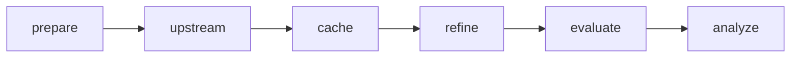

# QM9 跨领域实验：设计与运行

本文是 QM9 跨领域实验的权威说明，合并了原「研究计划」「任务设计」「集群运行」三份文档中不重复的部分。研究背景与文献见 `related_work.md`（不改动），本地结果见 `qm9_results_zh.md`，集群操作速查见 `cluster_handoff_qm9_full_zh.md`。

## 1. 背景与研究问题

把「把辅助任务的输出直接拼给下游读出是否合适」落实为可证伪实验。当前 `MT-embed-aux` 把辅助头的标量预测（α/R²/Cv）与全局 embedding `g` 直接拼接，属于弱组织：

1. 辅助预测是同一冻结 `g` 的确定性函数 `head_aux(g)`，`[g, head_aux(g)]` 相对 `g` 不增加与主任务的互信息，理论上是重参数化。
2. 原 jet SerialFlavour 的辅助价值来自**全局 pooling 会丢掉的局部/关系结构**（池化 origin 概率、pair 加权 embedding、pair 统计；图配方直接读逐 track 节点）。
3. QM9 原设计的辅助与主任务同属分子级标量，且辅助头只读 `g`。

**目标**：把「读出如何组织」与「辅助监督是否塑造了互补表示」分开，用容量匹配、输入消融、single-task 上游对照得到可证伪结论。判别式：

- `R0(g)` vs `R3(H)`：全局 pooling 损失了多少可用结构。
- `R4(H+u)` vs `R3(H)`：预测的局部/关系量在**完整局部表示之外**是否还有增量。
- `R2(g+u)` vs `R0(g)`：只反映压缩 `g` 的可读性/样本效率（不构成新增 Shannon 信息）。
- `U0` vs `U1`：辅助监督是否改变表示本身。

## 2. SchNet 调研结论（支撑任务选择）

- **NeurIPS 2017（arXiv:1706.08566）**：QM9 只做总能量 U0，单任务单模型；平衡态分子力恒为 0，**QM9 上无辅助任务**。辅助任务（原子间力）只在 MD17/ISO17，且 `F=−∂E/∂R` 与能量共享网络。
- **JCP 2018（arXiv:1712.06113）**：QM9 扩展到 12 个性质，但**每个性质单独一个模型**，不是多任务；α 与 ⟨R²⟩ 是原子分解假设最不适合的性质。
- **关键含义**：SchNet 辅助设计的精髓是**结构耦合**（逐原子、物理派生、旋转等变），不是独立标量头拼接；QM9 平衡态无法承载力辅助。因此本轮辅助改用 QM9 中真实存在的局部/关系标签：逐原子 Mulliken 电荷（T3）与逐对键级（T5），并让辅助头读局部表示。

## 3. QM9 任务设计

### 3.1 主任务 gap

- `gap = lumo − homo`，全局电子量，SchNet 2018 QM9 报告目标之一。
- QM9 原始属性行单位为 Hartree，报告统一换算为 **eV**（1 Ha = 27.211386 eV）；原始值在 manifest 记录。
- 指标 MAE(eV)/RMSE(eV)/R²；按验证集物理单位 MAE 选择 checkpoint。
- 捷径约束：主 gap 时禁止 HOMO/LUMO 作辅助。

### 3.2 辅助任务

- **T3 逐原子 Mulliken 电荷**：XYZ 原子行第 5 字段；逐原子回归；标准化空间 MSE；单位 e。
- **T5 全对键级多分类（dense）**：无序全对 `i<j`，5 类 `{无键,单,双,三,芳香}`；真值由 RDKit `rdDetermineBonds` 从 XYZ 推断（保持原子序，中性分子）；分开报告「键存在」与「真实键上的键级」指标。
- 暂不加：T1 谐振频率、T2 其他全局属性、T4 自监督。

### 3.3 上游模型与损失

```
共享 SchNet 编码器 h_i (64) → g = Σ_i h_i
gap 头:    g                 → 1
charge 头: [h_i, g]          → 1        （局部头，条件于 g，近似 origin）
bond 头:   [h_i, h_j, g]     → 5 logits （逐对，近似 pair）
```

- 模型 `hidden_channels 64, num_interactions 3, num_gaussians 32, cutoff 5.0, head_hidden [64,32]`；参数量 ST 62,977 / MT 87,943。
- 损失：`MSE(gap_norm) + w_c·mean_i MSE(charge_norm) + w_b·CE_weighted(bond)`，`w_c=w_b=1` 起步；`无键` 类不平衡用逆频率类权重，策略与权重写入 manifest。
- U0（single_task）= 仅 gap；U1（multi_task）= 三项。除损失外，结构/初始化/数据顺序/预算一致。

### 3.4 数据、划分与共享验证

- 数据：QM9 原始归档 `dsgdb9nsd.xyz.tar.bz2`（figshare 3195389）+ 作者排除名单 `uncharacterized.txt`（3195404），**CC0**；下载校验 MD5，处理后记录 SHA256。
- 去重：规范化 isomeric SMILES；排除官方 3,054 个分子；键感知/SMILES 失败记录在 manifest。
- **共享验证**（集群全量）：10k 验证集同时用于上游与下游选择（`a_val == b_val`）。这是本实验的已知方法学代价，结果中必须声明；Y-test 仍锁定。

| split | 本地 smoke | 集群全量 |
|---|---:|---:|
| a_train | 2,048 | 56,000 |
| b_train | 1,024 | 14,000 |
| validation（共享） | 256+256 | 10,000 |
| y_test | 512 | 20,000 |

- 标准化边界：上游标签/电荷仅拟合 A-train；下游特征与主标签仅拟合 B-train；输入坐标在解析时按分子质心平移到原点。

### 3.5 冻结缓存（下游可见）

- 冻结全部上游参数并 eval；缓存 `g`、逐原子 `h`、逐原子**预测电荷**、逐对**预测键类概率**、结构 offsets/pairs；**不缓存辅助真值**（aux-sup 臂单独读取真值并标注）。
- 缓存清单绑定 config/code/checkpoint/dataset/split 哈希；运行时校验冻结一致、字段有限、pair_index 为 split 全局坐标。

### 3.6 下游读出 recipes 与容量匹配

| 读出 | 输入 | 模型 | 回答 |
|---|---|---|---|
| R0 | `g` | 表格 MLP（零槽匹配） | 基本再读出的收益 |
| R1 | 预测电荷 + 预测键图（无 h/g） | GNN | 辅助预测单独能做多少 |
| R2 | `g` + 电荷/键级摘要 | 表格 MLP | 预测型辅助读出的增量 |
| R3 | 逐原子 `h`（H-only） | 集合读出 | 完整局部输入的收益 |
| R4 | `h` + 预测电荷 + 预测键概率 | GNN | 预测局部结构在 H 之外的增量 |
| aux-sup | 训练损失含辅助真值 | 独立命名 | 辅助监督正则化（使用真值） |
| 控制 | R4-shuffle（打乱边权） | — | 排除图结构假象 |

- R0/R2 同宽度（64 + 摘要 10），零槽精确参数匹配；R1/R4 容量未与 R3 严格匹配，报告参数量并用 dropout/weight_decay 缓解过拟合。
- 下游仅用主任务真值监督（main-only）；`aux-sup` 单独命名。

### 3.7 评估与诊断

- 主指标：Y-test gap MAE/RMSE/R²。
- 辅助诊断：逐原子电荷 MAE(e)；键存在 accuracy/AUC；真实键上键级 accuracy 与混淆矩阵。
- 配对增量（`summary.md`）：`pool_to_local_gain`（R0−R3）、`predicted_local_gain`（R3−R4）、`auxiliary_readout_gain`（R0−R2）、`auxiliary_supervision_gain`（ST-R0 − MT-R0）。

## 4. 代码结构

`cross-domain/`：

- 通用 pipeline（无 QM9 判断）：`pipeline/context.py`、`io.py`、`runtime.py`、`fit.py`、`readout.py`、`metrics.py`、`stages.py`、`units.py`、`run.py`、`run_unit.py`、`run_seed.py`、`run_pool.py`。
- QM9 领域模块：`data/qm9.py`、`model/qm9.py`、`training/qm9.py`、`refine/qm9.py`、`evaluate/qm9.py`、`analysis/qm9.py`。
- 配置：`config/qm9_gap_charge_bond_full.json`（集群）、`config/qm9_gap_charge_bond.json`（本地 smoke）。
- 测试：`tests/test_contracts.py`（14 项）。
- 启动器：`scripts/run_qm9_full.sh`。

外部 `src/`、`scripts/`、`configs/` 是 Jet tagging 实现，**不要修改**，仅作参考。

## 5. 运行

### 5.1 本地单进程阶段运行

```bash
source /home/yuyang/miniconda3/etc/profile.d/conda.sh
conda activate gn2_study_cross
cd /mnt/d/hep_analysis/gn2_study/SerialFlavour-cross
python -m pytest cross-domain/tests -q
python cross-domain/pipeline/run.py --config cross-domain/config/qm9_gap_charge_bond.json --stage all
```

`run.py` + `stages.py`：顺序执行 download/prepare/train/cache/refine/evaluate/analyze，用全局 `stage_state.json` 记录完成与产物 SHA256，适合本地单进程 smoke。

### 5.2 集群单节点多卡（单元调度）

不使用 SLURM。通用单元调度层：

- `pipeline/units.py`：枚举单元 `prepare`、`upstream:<variant>:<seed>`、`cache:<variant>:<seed>`、`refine:<variant>:<us>:<recipe>:<ds>`、`evaluate`、`analyze`；全量配置共 223 个（single_task 只含 R0/R3）。
- `pipeline/run_unit.py --config C --unit U`：执行单单元，写 `logs/<dataset>/<experiment>/units/<unit>.json`（状态 + 产物 SHA256），**不写 stage_state**，可并发；过滤条件不影响 `context.identity`。
- `pipeline/run_seed.py --config C --variant V --seed S --gpu N`：一个 `(variant, seed)` 全生命周期（上游 → 缓存 → 全部 `recipe × downstream_seed`），绑卡，已完成项跳过，成功后写 seed marker。
- `pipeline/run_pool.py --config C --gpus "0 1 2 3"`：先 `prepare`（有 marker 跳过），再把 seed 派发到空闲 GPU，最后 `evaluate`、`analyze`；失败 seed 记录后继续，结束非零退出。
- `scripts/run_qm9_full.sh`：入口，支持 `CONFIG/GPU_POOL/RETRIES/PYTHON/CONDA_ENV`。



续跑：seed marker `status == complete` 跳过；单 seed 内已存在的 `best.pt`/缓存也会跳过。

### 5.3 配置字段

`config/qm9_gap_charge_bond_full.json` 关键项：

- `data_root`（集群需改）、`output_root`（默认 `cross-domain/results`）、`log_root`（默认 `logs`）。
- `tasks`：`main gap`、`auxiliary []`、`local [charge, bond]`。
- `data`：`shared_validation true`、`validation_size 10000`、`candidate_multiplier 2`。

  `sizes`：共享验证下为 `{a_train, b_train, y_test}`（a_val/b_val 由验证块派生）；非共享下需全 5 键。
- `model`：smoke 尺寸（见 3.3）。
- `upstream`：`variants`、`seeds`、`epochs 100`、`batch_size 128`、`early_stopping_patience 20`。
- `refiner`：`seeds`、`recipes`、`epochs 300`、`set_epochs 300`、`set_learning_rate 3e-4`、`dropout 0.2`、`weight_decay 5e-4`、`clip_grad 1.0`、`early_stopping_patience 10`、`set_hidden 64`、`set_layers 2`。
- `runtime`：`device cuda`、`threads 8`、`num_workers 4`、`deterministic true`。

### 5.4 环境

统一 conda 环境 `gn2_study_cross`，增量依赖 `cross-domain/requirements-qm9.txt`（rdkit）。改为其他主机时修改 `data_root` 并更换 experiment 名。产物在 `results/<dataset>/<experiment>/`，日志在 `logs/`，均由 `.gitignore` 排除。

## 6. 风险与解释边界

- 电荷辅助偏易，可能不足以塑造表示；用辅助 R² 与读出增益的相关性诊断。
- 键存在≈几何：机制解释只看键级与 `R4−R3`。
- `无键` 类不平衡：逆频率权重，策略固定并记录。
- R1/R4（约 4 万参数）在 14k B-train 上有过拟合风险，已用 dropout/weight_decay 缓解，容量未严格匹配。
- 共享验证使上游/下游选择不独立；必须声明。
- GPU 确定性：`deterministic true` 需要 `CUBLAS_WORKSPACE_CONFIG`（已由 `runtime.configure` 设置）；若某算子不支持可改为 `false`。
- 解释边界：R2 增益只能表述为压缩 `g` 的可读性/样本效率；相对完整 `H` 无新增 Shannon 信息；机制归因需 `R4−R3`（同容量、输入消融）或 `U1−U0`。单种子 smoke 不追求显著性，不涉及骨架/构象外推。

## 7. 参考

- K. T. Schütt et al., NeurIPS 2017, arXiv:1706.08566。
- K. T. Schütt et al., J. Chem. Phys. 148, 241722 (2018), arXiv:1712.06113。
- R. Ramakrishnan et al., Sci. Data 1, 140022 (2014)（QM9 格式/单位）。
- RDKit `rdDetermineBonds`（xyz2mol）。
- 项目内：`related_work.md`、`qm9_results_zh.md`、`cluster_handoff_qm9_full_zh.md`、`../cross-domain/PIPELINE.md`。
