# SerialFlavour update on 2026-7-8

**摘要：**

本周工作主要是基于刘老师发的repo，整理了staged线性模型和parallel并行模型的代码，并使用600k样本训练，200k样本测试。相关代码上传到了dev branch。

模型的表现上，暂时还是parallel三个任务并行训练的效果更好（rejection、jet confusion trace、track confusion trace）。

然而，进一步分析staged线性模型不同任务表现的时候，发现vertex encoder（h2）的输出`refine`在训练中的输出几乎都变成了0，进而导致vtx_weight也几乎都为零。

尽管训练可以正常进行，但是这极大影响了staged线性模型的表现。refine归零的原因、以及如何合理使用vertex encoder h2的信息是下一步计划分析的内容。

## 代码准备

基于刘老师发的repo，把代码模块化重构了一下传到github上。
- 相关代码放到了[dev branch](https://github.com/prbbing/SerialFlavour/tree/dev)。

参考staged（track origin -> vertex regression -> jet flavour，线性训练3个任务）模型的参数，以及GN2的架构写了一个并行优化三个不同任务的parallel（jet flavour + track origin + track pair，并行训练3个任务）模型。

两个模型的均为约55k的参数量，32维的track embedding，具体配置在configs文件夹。
- staged：每个任务两层encoder，2个attention head。
- parallel：为保持参数量一致，使用了6层encoder，2个attention head。

## 具体进展

基于600k training samples，200k test samples，训练100 epoch。

训练表现：（还没有给不同任务的loss加上权重）
- parallel模型的track origin任务在loss下降中占主要，不过另外两个任务也有贡献。
- staged模型的vertex任务的loss在20轮左右发生骤降，且几乎主导了整个loss的下降。这是串行的第二个任务，是直接回归拟合Lxy的，即使加上dz，或者使用minimal的vertex特征也一样。
  - 但是100轮后，staged的loss还能降，考虑使用更多轮数的训练

测试表现
- roc 和 rejection：总是parallel的更好，staged的只有c vs light的表现好一些。
- track origin的任务，也是parallel的模型更好

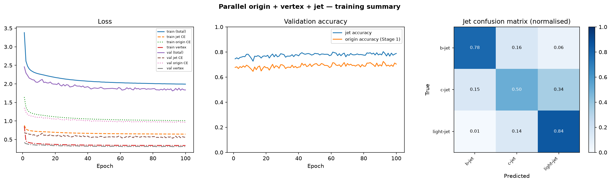

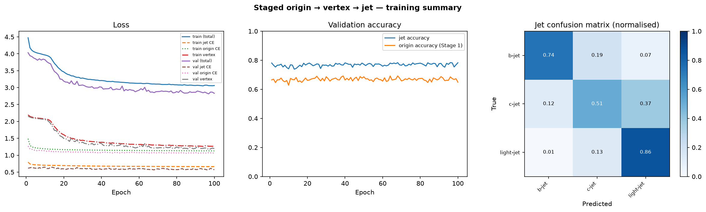

### staged model每个阶段的表现：
1. track origin：在绝大多数任务上都是parallel模型表现的更好。我认为这是合乎情理的，毕竟staged模型只是经过两层第一个encoder的单任务训练。见下图：（left：staged model；right：parallel model）

  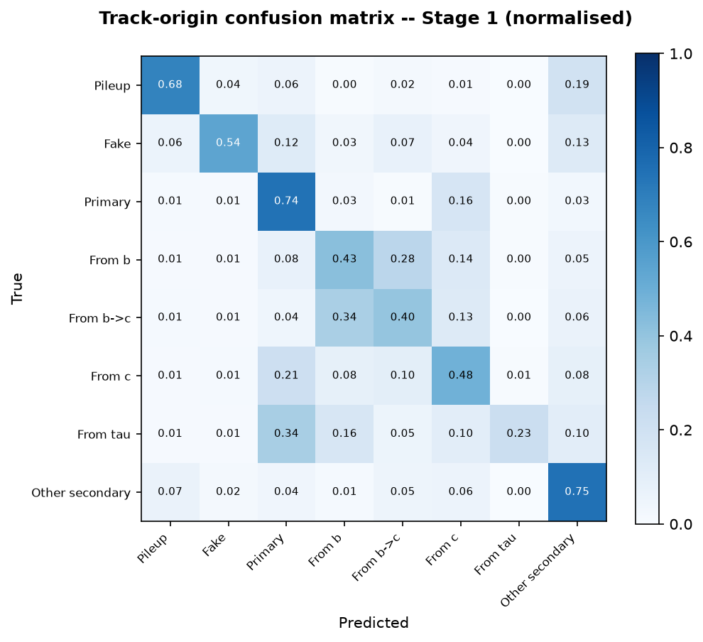
  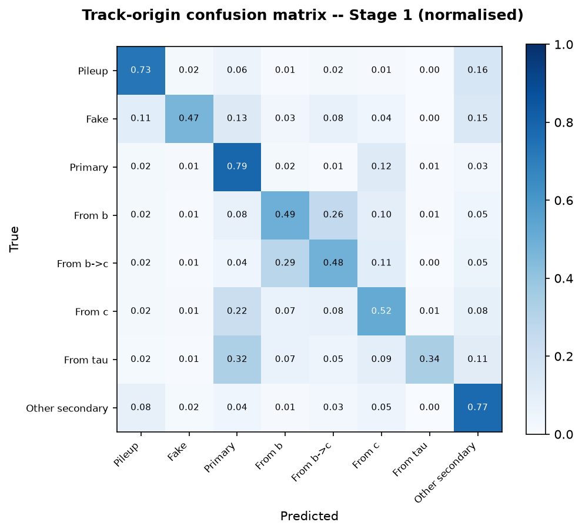

2. vertex predict（两个模型训练任务不太一样，不方便平行比较）
- 对于parallel模型，track pair模型的AUC有0.942，而且在predict score分布上可以把同顶点和不同顶点显著区分：same vertex的track pair的predict score更高

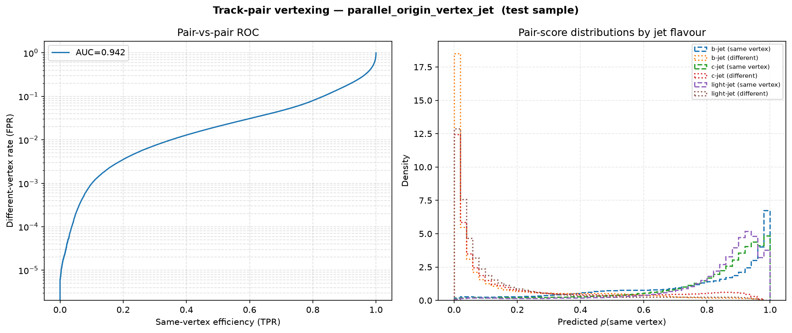
     
- 对于staged模型，dz更加弥散，Lxy分布大致贴合

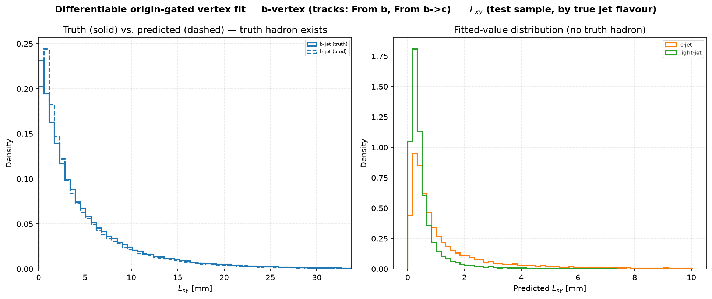

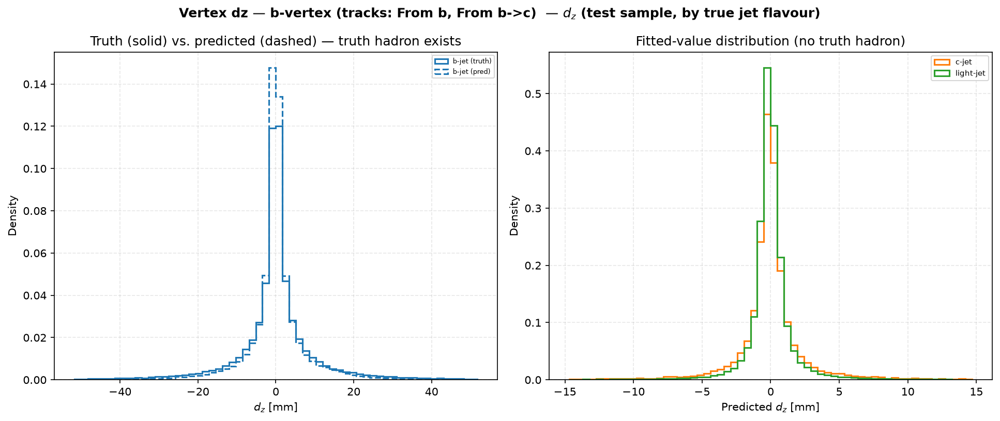

3. jet category：

parallel模型表现略微更好

**b jet tagging 工作点 rejection**

| 工作点    | staged `1/ε_c` | parallel `1/ε_c` | staged `1/ε_light` | parallel `1/ε_light` |
| --------- | -------------: | ---------------: | -----------------: | -------------------: |
| `ε_b=65%` |             18 |               20 |                364 |                  600 |
| `ε_b=70%` |             12 |               13 |                212 |                  329 |
| `ε_b=77%` |              7 |                7 |                 96 |                  127 |
| `ε_b=85%` |              3 |                4 |                 35 |                   41 |
| `ε_b=90%` |              2 |                2 |                 15 |                   17 |

**c jet tagging 工作点 rejection**

| 工作点    | staged `1/ε_b` | parallel `1/ε_b` | staged `1/ε_light` | parallel `1/ε_light` |
| --------- | -------------: | ---------------: | -----------------: | -------------------: |
| `ε_c=20%` |             21 |               26 |                 74 |                   61 |
| `ε_c=30%` |             12 |               14 |                 31 |                   27 |
| `ε_c=40%` |              7 |                9 |                 16 |                   13 |

**Jet classification report**

<table style="border-collapse: collapse; width: 100%; text-align: center; font-size: 14px;">
  <thead>
    <tr style="background-color: #f2f2f2;">
      <th style="padding: 8px; border: 1px solid #ddd;">类别</th>
      <th style="padding: 8px; border: 1px solid #ddd;">指标</th>
      <th style="padding: 8px; border: 1px solid #ddd;">Staged</th>
      <th style="padding: 8px; border: 1px solid #ddd;">Parallel</th>
      <th style="padding: 8px; border: 1px solid #ddd;">差值 (Staged − Parallel)</th>
    </tr>
  </thead>
  <tbody>
    <!-- b-jet -->
    <tr><td rowspan="3">b-jet</td><td>Precision</td><td>0.95</td><td>0.93</td><td style="color: #2e7d32;">+0.02</td></tr>
    <tr><td>Recall</td><td>0.74</td><td>0.78</td><td style="color: #d32f2f;">-0.04</td></tr>
    <tr><td>F1-score</td><td>0.83</td><td>0.85</td><td style="color: #d32f2f;">-0.02</td></tr>
    <!-- c-jet -->
    <tr><td rowspan="3">c-jet</td><td>Precision</td><td>0.25</td><td>0.26</td><td style="color: #d32f2f;">-0.01</td></tr>
    <tr><td>Recall</td><td>0.51</td><td>0.50</td><td style="color: #2e7d32;">+0.01</td></tr>
    <tr><td>F1-score</td><td>0.34</td><td>0.34</td><td style="color: #666;">0.00</td></tr>
    <!-- light-jet -->
    <tr><td rowspan="3">light-jet</td><td>Precision</td><td>0.88</td><td>0.89</td><td style="color: #d32f2f;">-0.01</td></tr>
    <tr><td>Recall</td><td>0.86</td><td>0.84</td><td style="color: #2e7d32;">+0.02</td></tr>
    <tr><td>F1-score</td><td>0.87</td><td>0.86</td><td style="color: #2e7d32;">+0.01</td></tr>
  </tbody>
</table>

*更多细节可以参考results不同文件夹的内容。*

## 下一步展望

### 目前问题：refine issue

更细致的评估发现，staged模型的vtx_weight在训练中几乎全部变成了0（尽管训练还能正常进行）。`vtx_weight = refine * gate * mask_f `，其中refine参数在staged中接收vertex encoder模型的h2输出（包含处理过的vertex feature of track的信息），gate接收来自track origin encoder的信息（判断track属于某类顶点的概率）。这个`vtx_weight`之后会进一步用于Lxy、dz的预测拟合。
- `refine`根据track的几何特征，给不同track在顶点拟合中的不同权重，以优化顶点拟合的表现。

*下图为原本staged模型训练后的`vtx_weight`分布，可以看出几乎完全归零*

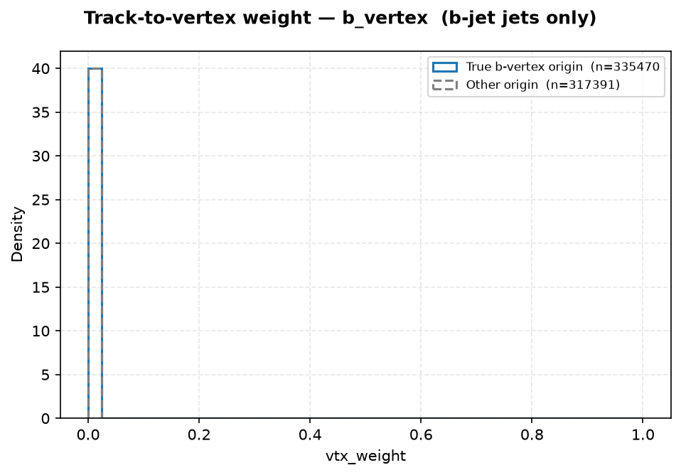

经过进一步分析，问题出在`refine`上，`refine`在训练中几乎全部成为了0，这极大影响了`vtx_weight`的表现。
- 甚至去除该乘项后，使用原来的staged模型重新评估，b jet / light jet的rejection都能优化将近1倍，接近parallel模型的表现。尽管这直接放弃了vertex feature，但依然有很好的表现。

#### no refine 模型的表现
*下图为原本staged模型完全去掉refine进行训练的结果，jet confusion matrix的迹比原本有refine的staged模型略好*

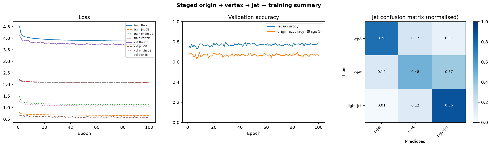

*下图为原本staged模型完全去掉refine进行训练的vtx_weight分布，可以看到是合理的*

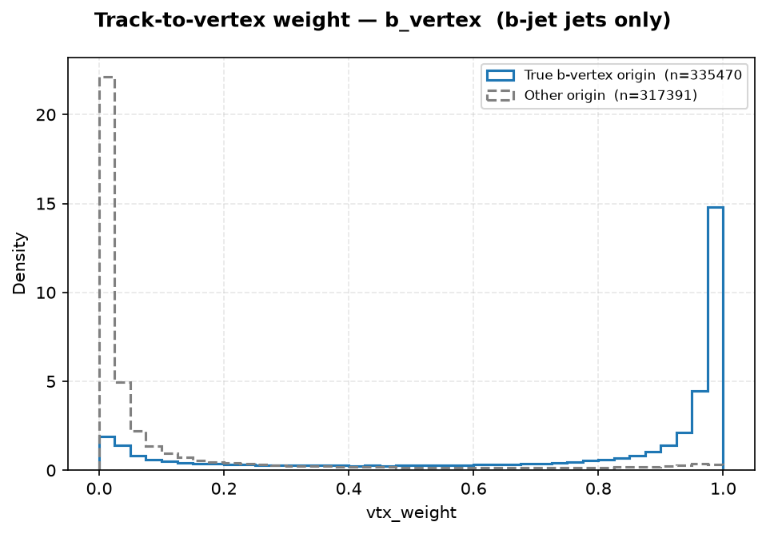

#### 性能分析：

1.  rejection的整体表现也优于原本有refine的staged模型

**b jet rejection**

| 工作点    | staged `1/ε_c` | no refine `1/ε_c` | parallel `1/ε_c` | staged `1/ε_light` | no refine `1/ε_light` | parallel `1/ε_light` |
| --------- | -------------: | ----------------: | ---------------: | -----------------: | --------------------: | -------------------: |
| `ε_b=65%` |             18 |                17 |               20 |                364 |                   417 |                  600 |
| `ε_b=70%` |             12 |                11 |               13 |                212 |                   254 |                  329 |
| `ε_b=77%` |              7 |                 6 |                7 |                 96 |                   111 |                  127 |
| `ε_b=85%` |              3 |                 3 |                4 |                 35 |                    38 |                   41 |
| `ε_b=90%` |              2 |                 2 |                2 |                 15 |                    16 |                   17 |

去掉 refine 后 light-jet rejection 显著提升（364→417），接近 parallel 模型的 70% 水平（600）；c-jet rejection 略降（18→17 vs parallel=20）。

**c jet rejection**

| 工作点    | staged `1/ε_b` | no refine `1/ε_b` | parallel `1/ε_b` | staged `1/ε_light` | no refine `1/ε_light` | parallel `1/ε_light` |
| --------- | -------------: | ----------------: | ---------------: | -----------------: | --------------------: | -------------------: |
| `ε_c=20%` |             21 |                23 |               26 |                 74 |                    60 |                   61 |
| `ε_c=30%` |             12 |                13 |               14 |                 31 |                    27 |                   27 |
| `ε_c=40%` |              7 |                 8 |                9 |                 16 |                    14 |                   13 |

c-tagging 方面，no refine 的 b-jet rejection 小幅改善（21→23），light-jet rejection 退化（74→60），整体仍弱于 parallel（26/61）。

2. 同时，dz的预测能力下降了很多，是之后需要关注的一个点。见下图：

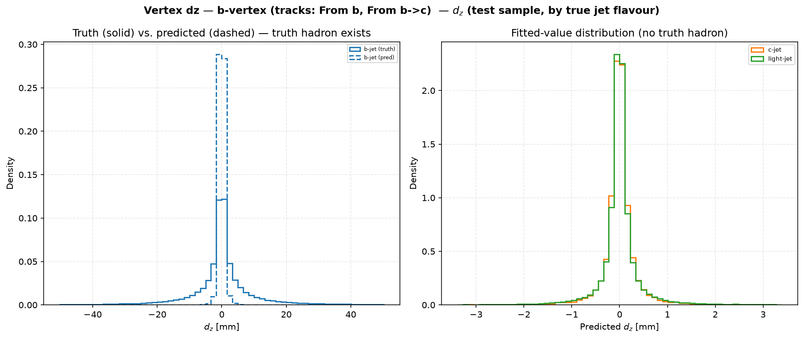

### 下一步计划：
- 进一步**分析refine归零的原因**，即从h2的输出到refine的输出阶段。
- 合理**使用vertex encoder h2的信息**。
  - 思路一：考虑将原先的乘积项，修改为根据h2输出进行一个权重残差项。【初步进展：训练振荡极大，待优化】
